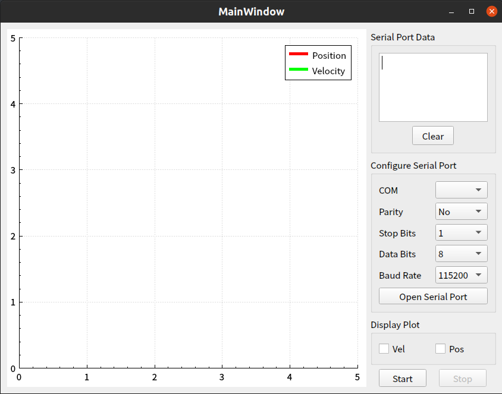

## 可视化串口程序

### Data Format

receive position and velocity data. The data format is as follows:

Position: ‘D’ + ‘A’ + ‘T’ + ‘A’ + position data(float) + ‘E’ + ‘N’ + ‘D’  

Velocity: ‘D’ + ‘A’ + ‘T’ + ‘A’ + velocity data(float) + ‘E’ + ‘N’ + ‘D’  